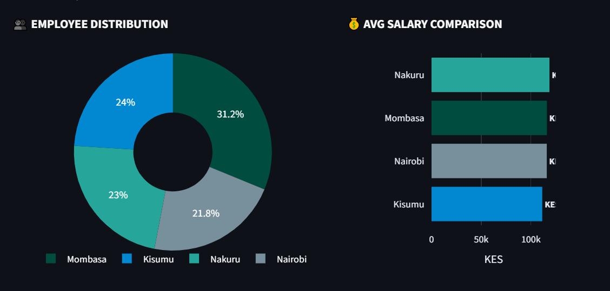
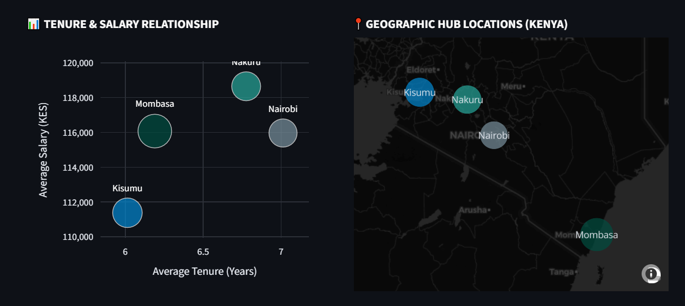

# HRM Executive Dashboard

A real-time Human Resource Management (HRM) web application built to deliver operational insights and workforce analytics for regional hubs across Kenya.

👉 **[Live Project Demo](https://lawrenceotieno-hrm-executive-dashboard-app-wggi3y.streamlit.app/)**

---

## 🌓 Theme Customization
The interface includes a responsive theme toggle feature at the top-right corner to allow stakeholders to adjust display configurations based on lighting environments for maximum clarity and high visibility. It supports seamless transitions across System, Light, and Dark mode baselines:


---

## 📊 Core High-Level Metrics
The dashboard aggregates organizational metrics globally or filters down by specific regional hubs:
* **Total Headcount:** 500 Staff
* **Overall Turnover Rate:** 11.6% *(📉 1% Left)*
* **Average Annual Salary:** KES 115,517

---

## 📈 Visual Analytics & Charts

### 1. Workforce Distribution & Remuneration Benchmarks
Provides a visual breakdown of both staff allocation profiles and wage differences across key regional metrics:
* **Employee Distribution:** Maps proportional representation across main office hubs—Nakuru leads at 31.2%, followed by Mombasa (24.0%), Kisumu (23.0%), and Nairobi (21.8%).
* **Average Salary Comparison:** A structured side-by-side wage benchmark evaluated in Kenyan Shillings (KES), highlighting Nakuru as the top baseline wage zone and Kisumu as the leanest resource budget area.



### 2. Tenure Analytics & Geographic Hub Locations
* **Tenure & Salary Relationship:** Maps employee longevity against financial compensation. Displays a visible correlation cluster where longer-tenured hubs (like Nairobi and Nakuru) balance alongside competitive market salary baselines.
* **Geographic Hub Locations:** A geospatial reference layer pin-pointing operational focus centers across Kenya including clusters in Kisumu, Nakuru, Nairobi, and Mombasa.



---

## 📋 Comprehensive Hub Breakdown & Controls
Data matrices sliceable via the multi-select filter controls panel:

| Location Hub | Employee Count | Average Salary (KES) | Average Tenure |
| :--- | :---: | :---: | :---: |
| **Kisumu** | 120 | KES 111,381.0 | 6.0 Years |
| **Mombasa** | 156 | KES 116,075.0 | 6.2 Years |
| **Nairobi** | 109 | KES 115,964.0 | 7.0 Years |
| **Nakuru** | 115 | KES 118,650.0 | 6.8 Years |

### Interactive Filters Panel
Users can slice data on the fly by selecting or removing targets inside the regional control widget:


---

## 🛠️ Tech Stack & Controls
* **Framework:** Streamlit (UI & Rendering engine)
* **Controls:** Navigation & Controls side panel featuring localized multi-select filters, app cache refresh (`C`), canvas print functions, and integrated display screen-recording capacities.

---

## 🚀 Local Setup & Installation

Create and activate a virtual environment:

```bash
python -m venv .venv
source .venv/bin/activate  # On Windows use: .venv\Scripts\activate
```

Install the clean requirements:

```bash
pip install -r requirements.txt
```

Launch the application:

```bash
streamlit run app.py
```
